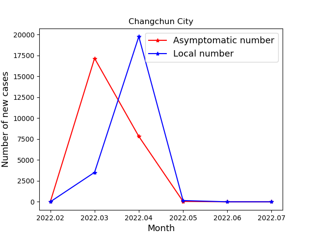
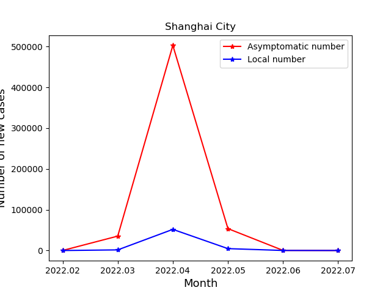
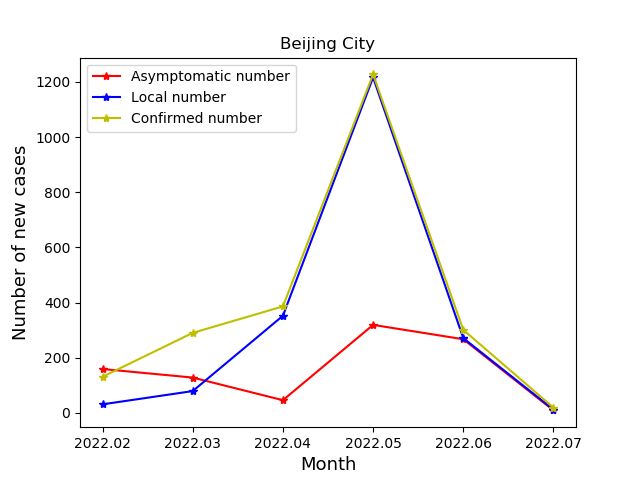
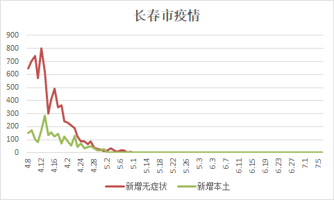

+++
title = "2022数学建模模拟三"
date = "2022-05-01T18:18:21+08:00"
tags = ["software"]
slug = "2022数学建模模拟三"
+++
# 参考数据

[全国疫情数据分析.xlsx](./assets/全国疫情数据分析.xlsx)
[第一问.xlsx](./assets/第一问.xlsx)
[四个地区（北京，上海，长春，安徽省）迁移指数表 2022 年.xlsx](./assets/四个地区（北京，上海，长春，安徽省）迁移指数表2022年.xlsx)

# 参考资料

B：疫情题（语文建模，推荐能言善辩的队伍选择）
第一问，预测清零时间反正就 SIR 模型吧，网上有很多参考就不多说，能获取到历史数据的网站推荐新浪疫情、网易疫情（有城市的累计死亡、累计感染、累计治愈数据），文档也给大家整理了一些，后续还会补充。仅考虑传染病模型显然是不足的，结合第二问，经济发展水平其实一定程度上能反映出一个地区的医疗物资的保供能力，那么势必会结合疫情期间的资源配送情况，具体运送了多少物资肯定不知道的，那么可以用迁入指数（疫情期间一般是物资配送）作为替代指标，只看城市的整体迁入指数就行，如下图，其他的指标都不是特别重要，主要是物资运送，第一问就在 SIR 模型中将迁入指数作为影响治愈率的影响因子就行，政治因素没办法量化，就不做考虑。下面是百度迁徙指数的上海迁入指数情况，网上直接搜“百度迁徙指数”就行，自己爬取下数据下来，不行就人工统计。假设不考虑政治等因素，有了参数就去推导下上海和北京清零时间。
第二问，就是说不能因为疫情防控，就限制了居民看病的权利，可以去查一下当地医院总数和用于新冠治疗的医院数，更多而医疗机构加入到抗疫当中自然疫情能够得到很好地解决，但是反过来看，会增加一些重症疾病的死亡率，本文大家可以假设一所医院的服务的患者数，该地区患者存在重症的概率，每有一所医院加入到抗击新冠行列中，新冠治愈率会得到提高，但是对于重症疾病患者的治愈率会降低，构建一个博弈模型进行推导，得到最佳用于抗击新冠的意愿数。也是封长春、上海、北京讨论并做对比分析。【本问主要是个方法描述，参数大小自己设置就行】
第三问，根据平均入住率先推导出每栋楼的户数，根据总数推导一户平均有多少人，然后计算得到每栋楼有多少人。核酸检测点肯定有多个，本题就这么来考虑，一个核酸点检测多栋楼，那么本题可以考虑为一个优化算法，自变量为核酸检测点数，不同的核酸检测点位，又有不同的分组情况，也就是有不同的人数，假设检测一人需要 10s 中，那么该小区完成核酸检测的时间以检测最后一个人为准，由此可以进行优化算法寻优，以核酸检测点数最小且核酸完整时间最小为目标函数，进行多目标寻优。
第四问，这个现象我们平常生活经常见到，一个骑手可能会到多个地方去送餐，在疫情期间，如果能将需求进行打包，这样就可以很大程度上减少交互行为，本问可以随机模拟一些需求点，默认每个需求点需求量为 1，如果十分邻近的点可以取平均作为一个点，且需求量相加表示，背景就假设有足够的骑手配送，但是每次配送有需求量限制，然后对需求点进行打包，尽可能满足打包内的需求点尽可能集中，目标函数可以是所有打包内中的各点的平均距离之和，进行最小化寻优。【本问主要是个方法描述，参数大小自己设置就行】
第五问，无法提供，自己编吧
[传染病模型和微分方程拟合的课件和代码.zip](./assets/传染病模型和微分方程拟合的课件和代码.zip)

# 用到的图

